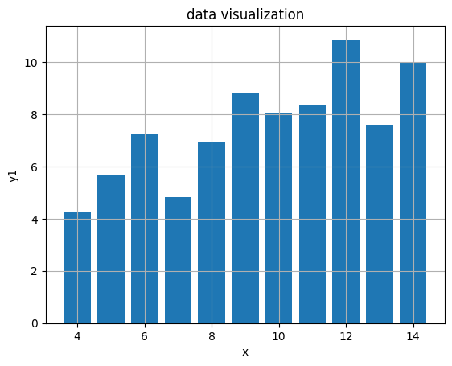
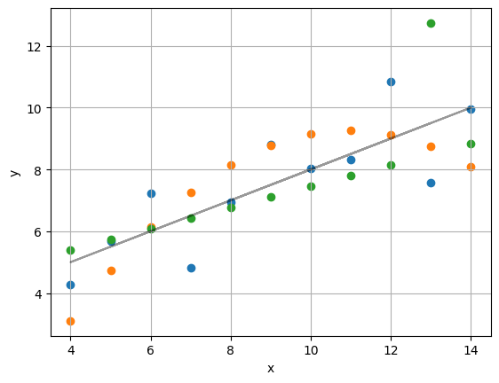
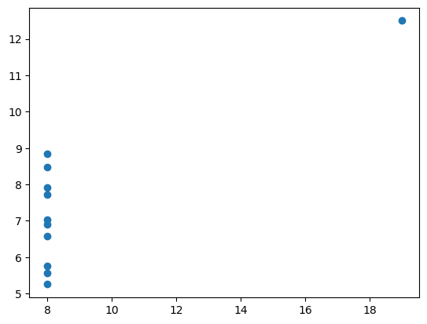

Using matplotlib and Jupyter Notebook, I was able to create a graph of Anscombe's Quartet and get some statistics about it.

Before creating any graph, I imported matplotlib and listed all my values.

```ruby
import matplotlib.pyplot as plt
import numpy as np

x = [10, 8, 13, 9, 11, 14, 6, 4, 12, 7, 5]
y1 = [8.04, 6.95, 7.58, 8.81, 8.33, 9.96, 7.24, 4.26, 10.84, 4.82, 5.68]
y2 = [9.14, 8.14, 8.74, 8.77, 9.26, 8.10, 6.13, 3.10, 9.13, 7.26, 4.74]
y3 = [7.46, 6.77, 12.74, 7.11, 7.81, 8.84, 6.08, 5.39, 8.15, 6.42, 5.73]

x4 = [8, 8, 8, 8, 8, 8, 8, 19, 8, 8, 8]
y4 = [6.58, 5.76, 7.71, 8.84, 8.47, 7.04, 5.25, 12.50, 5.56, 7.91, 6.89]
```
To start, I first created a bar graph with the first dataset.

```ruby
plt.bar(x, y1)
plt.xlabel("x")
plt.ylabel("y1")
plt.title("data visualization")
plt.grid(True)
```



After that, I made a scatter plot with y1-3. It also shows the regression line and its equation.
```ruby
plt.scatter(x, y1)
plt.scatter(x, y2)
plt.scatter(x, y3)
plt.grid(True)

plt.xlabel("x")
plt.ylabel("y")

m, b = np.polyfit(x, y1, 1)
y_pred = m * np.array(x) + b
print("Slope (m):", m)
print("Intercept (b):", b)
x_line = np.array(x)
y_line = m * x_line + b
plt.plot(x_line, y_line, color='black', label='Regression line', alpha = 0.4)
print(f"regression line: y = {m}x + {b}")
ss_res = np.sum((np.array(y1) - y_pred) ** 2)   # residual sum of squares
ss_tot = np.sum((np.array(y1) - np.mean(y1)) ** 2)  # total sum of squares
r2 = 1 - (ss_res / ss_tot)
```


Here's the one for y4.
```ruby
plt.scatter(x4, y4)
```


Lastly, I was able to get some means, variances, and some other stuff that I don't understand to be honest (but I still did it).
```ruby
mean_x = np.mean(x)
print("Mean of x:", mean_x)

variance_x = np.var(x, ddof=1)
print("Variance of x:", variance_x)

mean_y = np.mean(y1)
print(f"Mean of y: {mean_y:.2f}")

variance_y = np.var(y1, ddof=1)
print("Variance of y:", variance_y)

corr_xy = np.corrcoef(x, y1)[0, 1]
print("Correlation between x and y:", corr_xy)

print(f"R²: {r2:.2f}")
```
```
Mean of x: 9.0
Variance of x: 11.0
Mean of y: 7.50
Variance of y: 4.127269090909091
Correlation between x and y: 0.81642051634484
R²: 0.67
```

